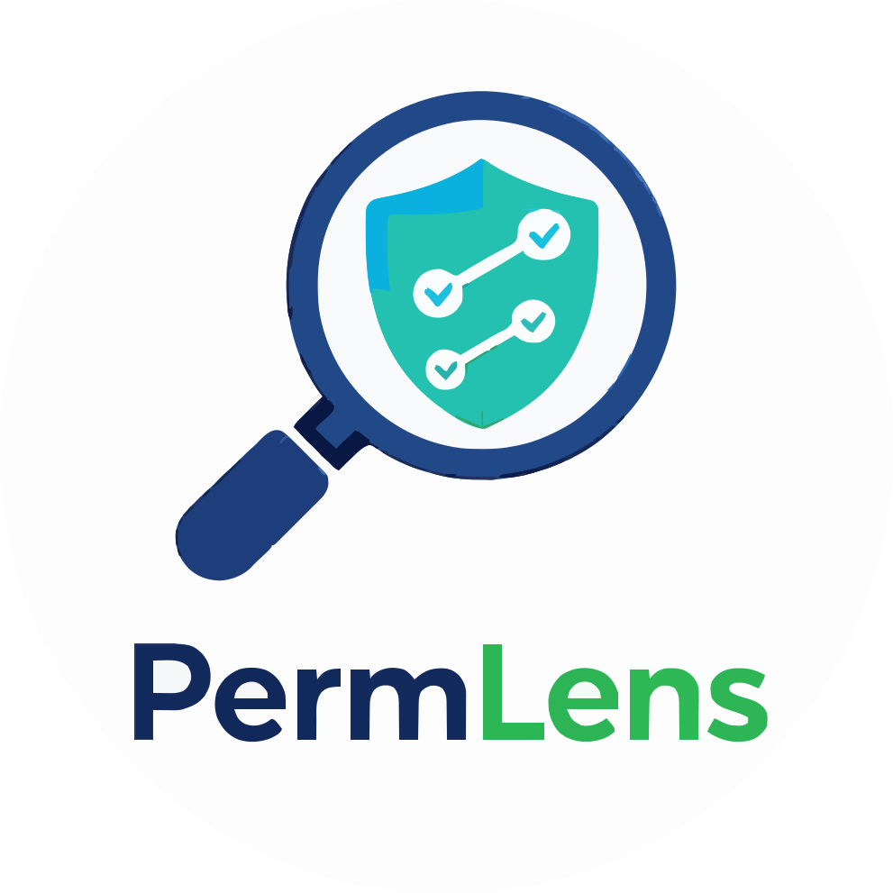

<p align="center">
  
</p>

<p align="center">
  
  
</p>


# PermLens 🔍

Permission transparency and privacy labeling for GitHub Apps.

PermLens helps developers and reviewers understand what data a GitHub App *declares* access to, using publicly available metadata.


## Table of Contents

- [ℹ What is PermLens?](#ℹ-what-is-permlens)
- [✅ What PermLens does](#-what-permlens-does)
- [🚫 What PermLens does NOT do](#-what-permlens-does-not-do)
- [❓ How it works](#-how-it-works)
- [⚙ API](#-api)
  - [Get privacy label for a GitHub App](#get-privacy-label-for-a-github-app)
- [📘 API Response Reference](#-api-response-reference)
  - [Response fields](#response-fields)
  - [Resolution behavior](#resolution-behavior)
  - [Cache behavior](#cache-behavior)
  - [API request behavior](#api-request-behavior)
  - [Rate limiting behavior](#rate-limiting-behavior)
- [🚧 Project status](#-project-status)
- [🔐 Security and privacy](#-security-and-privacy)
- [🏷️ Branding](#️-branding)
- [⚖️ License](#️-license)


## ℹ What is PermLens?

PermLens provides human-readable visibility into **GitHub App permissions** and the types of data an app may access.

It generates a structured, privacy-label-style summary based on an app’s declared permissions, helping users reason about permission scope at a glance.

PermLens is an **informational transparency tool**, not a security scanner.


## ✅ What PermLens does

- Resolves GitHub Apps by marketplace slug (when available)
- Fetches declared GitHub App permissions via the GitHub API
- Explains permissions in clear, plain language
- Groups permissions into predefined data access categories
- Generates a structured privacy label with sensitivity levels
- Presents results through a web-based frontend interface

The output is designed to be predictable, stable, auditable, and safe to consume programmatically.


## 🚫 What PermLens does NOT do

PermLens does **not**:

- Inspect application source code or runtime behavior
- Monitor network activity or data exfiltration
- Scan repositories, workflows, or secrets
- Access private repositories or user data
- Act on behalf of users or organizations
- Guarantee security, safety, or compliance

PermLens reflects **what an app declares**, not what it actually does at runtime.


## ❓ How it works

1. Attempts to resolve a GitHub App by its marketplace slug
2. Fetches the app’s declared permissions using the GitHub API
3. Maps permissions to predefined data access categories
4. Computes an overall sensitivity level
5. Returns a privacy-label-style summary

If an app cannot be resolved by slug, PermLens safely falls back to its own declared permissions. In this case, PermLens authenticates as a GitHub App using JWT to fetch its metadata and explicitly reports the resolution status in the response.

Only public GitHub App metadata is used.


## ⚙ API

### Get privacy label for a GitHub App

```http
GET /api/app/:slug/label
```

Response schema:

```json
{
  "resolved": "boolean",
  "fallback": "boolean",
  "rate_limits": {
    "unauthenticated": "boolean",
    "authenticated": "boolean"
  },
  "api": {
    "unauthenticated_hit": "boolean",
    "authenticated_hit": "boolean"
  },
  "cache": {
    "hit": "boolean",
    "cached_at": "ISO_8601 string | null"
  },
  "label": {
    "data_categories": [
      {
        "key": "string",
        "label": "string",
        "sensitivity": "low | moderate | high",
        "description": "string"
      }
    ],
    "overall_sensitivity": "low | moderate | high",
    "permissions": [
      {
        "name": "string",
        "access": "read | write"
      }
    ],
    "notes": ["string"]
  }
}
```


## 📘 API Response Reference

### Response fields

| Field | Description | Possible values |
|------|-------------|-----------------|
| `resolved` | Whether the requested GitHub App slug was successfully resolved via the GitHub API | `true` \| `false` |
| `fallback` | Whether PermLens fell back to its own GitHub App permissions | `true` \| `false` |
| `rate_limits.unauthenticated` | Whether the unauthenticated GitHub API rate limit was exceeded | `true` \| `false` |
| `rate_limits.authenticated` | Whether the GitHub App–authenticated API rate limit was exceeded | `true` \| `false` |
| `api.unauthenticated_hit` | Whether an unauthenticated GitHub API request was made | `true` \| `false` |
| `api.authenticated_hit` | Whether a GitHub App–authenticated request was made (typically fallback) | `true` \| `false` |
| `cache.hit` | Whether the response was served from cache | `true` \| `false` |
| `cache.cached_at` | Timestamp of cached response generation | ISO 8601 timestamp \| `null` |
| `label.data_categories` | Data access categories derived from declared permissions | array of objects |
| `label.data_categories[].key` | Internal category identifier | string |
| `label.data_categories[].label` | Human-readable category name | string |
| `label.data_categories[].sensitivity` | Sensitivity level for the category | `low` \| `moderate` \| `high` |
| `label.data_categories[].description` | Description of the category | string |
| `label.overall_sensitivity` | Highest sensitivity level across all categories | `low` \| `moderate` \| `high` |
| `label.permissions` | Declared GitHub App permissions | array of `{ name, access }` |
| `label.permissions[].name` | Permission name | string |
| `label.permissions[].access` | Permission access level | `read` \| `write` |
| `label.notes` | Informational notes about label generation | array of strings |
| `error` | Error message when label generation fails | string \| absent |

### Resolution behavior

- `resolved: true`, `fallback: false` -> requested app resolved by slug
- `resolved: false`, `fallback: true` -> unresolved slug; PermLens fallback used
- `resolved: false`, `fallback: false` -> unable to resolve and fallback failed (often rate limit)

### Cache behavior

- `cache.hit: true` -> served from in-memory cache
- `cache.hit: false` -> fresh GitHub API data
- `cache.cached_at` is present only when `cache.hit` is `true`

### API request behavior

- `api.unauthenticated_hit: true` -> public GitHub API request was attempted
- `api.authenticated_hit: true` -> authenticated fallback request was attempted
- if `cache.hit: true`, then both API hit flags are `false`

### Rate limiting behavior

- `rate_limits.unauthenticated: true` -> public GitHub API rate limit hit
- `rate_limits.authenticated: true` -> GitHub App authenticated rate limit hit
- if both are `true`, no app data can be fetched


## 🚧 Project status

PermLens is in **early development**.

Version **v0.3.0** introduces:

- In-memory caching for label lookups
- Explicit cache and API metadata in response payloads
- Clear unauthenticated vs authenticated rate limit reporting
- Improved frontend UX for cached, fallback, and rate-limited cases

APIs and schemas may evolve as the project matures.


## 🔐 Security and privacy

- Uses GitHub App authentication (JWT-based) where applicable
- Requests minimal, read-only access
- Based on public GitHub metadata only
- Does not store user, repository, or organization data


## 🏷️ Branding

The PermLens name, logo, and visual branding are **not** covered by the open-source license for this repository.

Use of the PermLens name or logo in a way that suggests endorsement, affiliation, or official status requires explicit permission from the project author.


## ⚖️ License

Released under the terms of [Apache License 2.0](LICENSE).